# 🛡️ Inventario de Activos — Ciberseguridad (ENS / NIS2 / OT)

Una herramienta de escritorio multiplataforma diseñada para facilitar a los auditores, CISOs y equipos de IT/OT la gestión de sus activos tecnológicos, garantizando el cumplimiento normativo.

Desarrollada en **Python** con una interfaz moderna tipo **Fluent/WinUI 3**, ofrece una base de datos local y autónoma (sin dependencias en la nube) orientada a la privacidad.

---

## 📸 Vistas de la Aplicación

El inventario cuenta con dos temas visuales (Estándar y Retro) para adaptarse a tus preferencias. 

| Tema Estándar (WinUI Light) | Tema Retro (Dark Mode) |
| :---: | :---: |
| **Dashboard Analítico** | **Dashboard Analítico** |
| 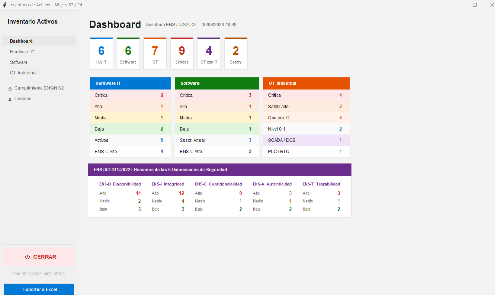 | 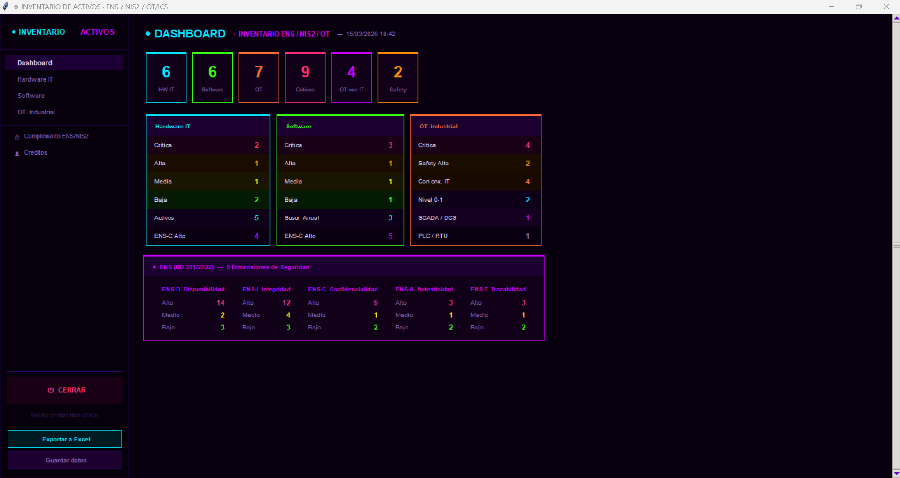 |
| **Módulo OT / Industrial** | **Módulo OT / Industrial** |
| 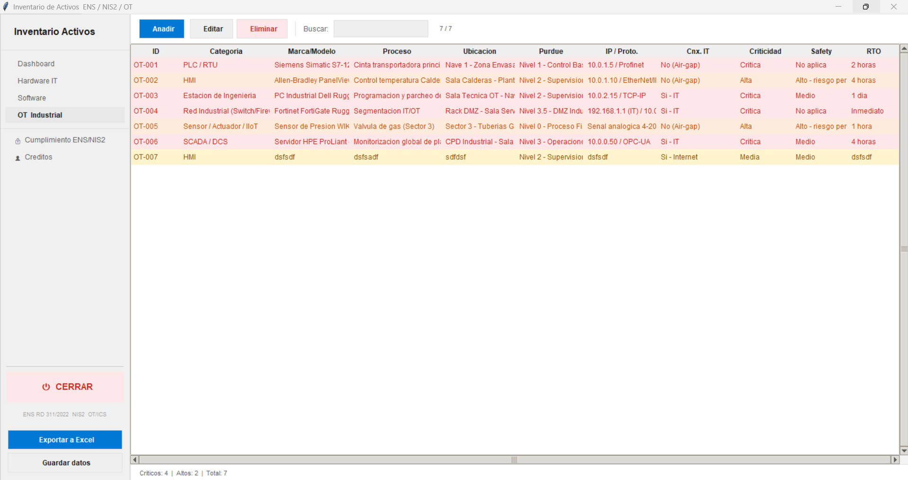 | 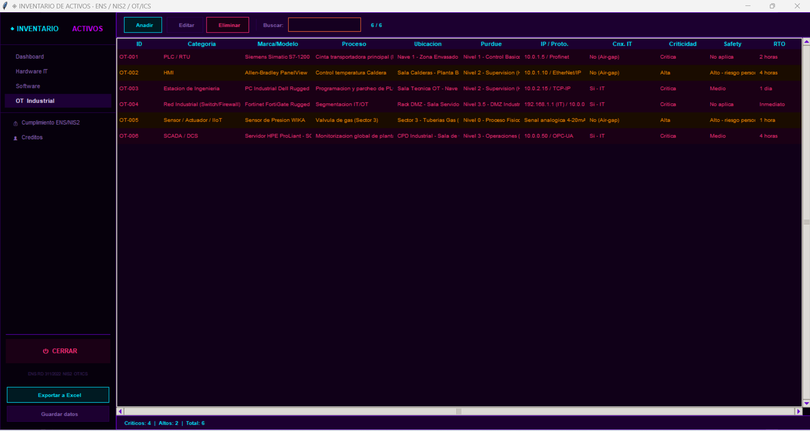 |

---

## ✨ Características Principales

* **Cumplimiento ENS (RD 311/2022):** Valoración integrada de las 5 dimensiones (Disponibilidad, Integridad, Confidencialidad, Autenticidad, Trazabilidad).
* **Adaptado a la Directiva NIS2:** Gestión de RTOs, criticidad de la cadena de suministro y dependencias entre sistemas.
* **Módulo OT/ICS Exclusivo:** Control de activos industriales basado en el Modelo Purdue, visibilidad de conectividad IT/Internet y evaluación de riesgos físicos (Safety).
* **Dashboard Analítico:** KPIs en tiempo real para visualizar rápidamente los activos críticos y el estado de la red.
* **Exportación para Auditorías:** Generación de informes en Excel (`.xlsx`) listos para entregar.
* **Privacidad Total:** Los datos se guardan en un archivo JSON local en tu máquina. Nada sale a internet.

## 📦 Descargas e Instalación

### 🪟 Windows
Descarga el instalador desde la sección de **Releases**.
1. Descarga `InventarioActivos_Setup.exe` (Estándar) o `InventarioActivosRetro_Setup.exe` (Modo oscuro).
2. Ejecuta el instalador y sigue los pasos.
3. El programa creará un acceso directo en tu escritorio.

### 🐧 Linux (Debian / Ubuntu)
1. Descarga el paquete `inventarioactivos.deb` desde **Releases**.
2. Instálalo usando dpkg:
   `sudo dpkg -i inventarioactivos.deb`
3. Si faltan dependencias, ejecuta:
   `sudo apt-get install -f`

## 📱 Versión Android (Multiplataforma 100%)

Porque los auditores también te pillan en los pasillos o en la planta de producción, aquí tienes la versión nativa para Android. Mantiene la misma filosofía: cero nubes, cero suscripciones y 100% local (Zero Cloud Data).

Y como no podía ser de otra forma, la app móvil también viene con los dos sabores para que instales el que más rabia te dé (puedes instalar ambos, no se pisan entre ellos):

### 🕶️ Modo Retro / Dark (Neon Synthwave)
Para clasificar activos de red como si estuvieras hackeando el mainframe de una megacorporación en 1985.

<p align="center">
  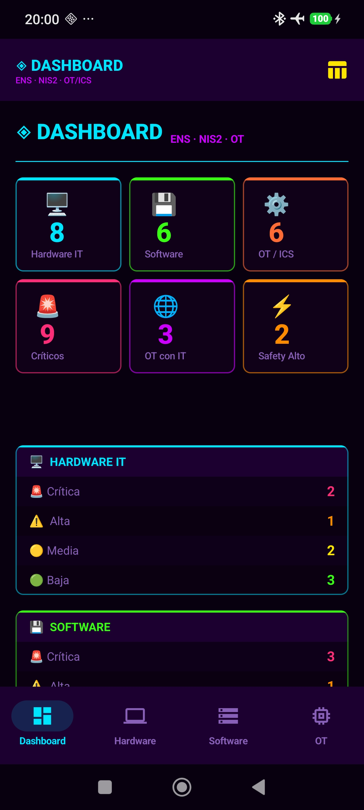
  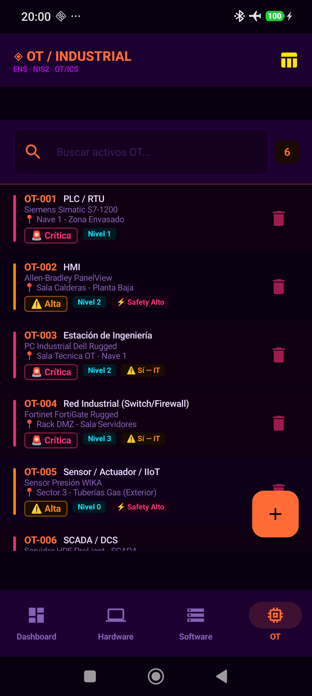
</p>

### 👔 Modo Oficina / Claro (Corporate Compliance)
Una interfaz limpia, clarita y formal. Ideal para cuando tienes al CISO o al jefe mirando por encima del hombro y necesitas parecer institucional.

<p align="center">
  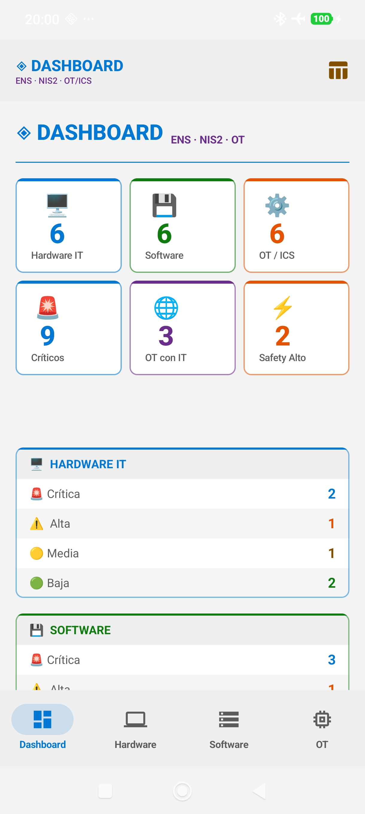
  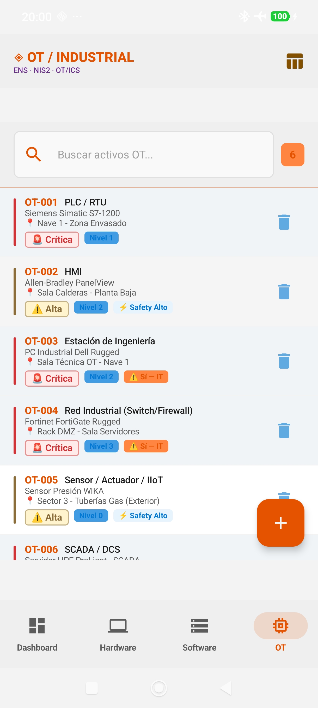
</p>

---

### 📥 Descarga e Instalación (.apk)

Tienes los instaladores listos en la pestaña de **Releases** de este repositorio.

Al ser una herramienta libre y no estar en la Google Play Store, la instalación se hace mediante *sideloading* (descarga directa):

1. Descarga el archivo que prefieras:
   * `Inventario_Activos_Retro.apk` (Versión Oscura)
   * `Inventario_Activos_Oficina.apk` (Versión Clara)
2. Abre el archivo en tu móvil Android.
3. Si el sistema te lo pide, acepta el permiso para **"Instalar aplicaciones de orígenes desconocidos"** (tranquilo, el código es 100% abierto y lo puedes revisar aquí mismo).

## 🌐 Versión Web (PHP)

Además de la versión de escritorio, este proyecto incluye una versión web completa diseñada para ser alojada en un servidor interno (Intranet) o en la nube. Está pensada para equipos de ciberseguridad y administradores de sistemas que necesitan acceso concurrente al inventario desde cualquier dispositivo.

### 📸 Vistazo a la Interfaz

**Dashboard Resumen (Métricas ENS / NIS2)**
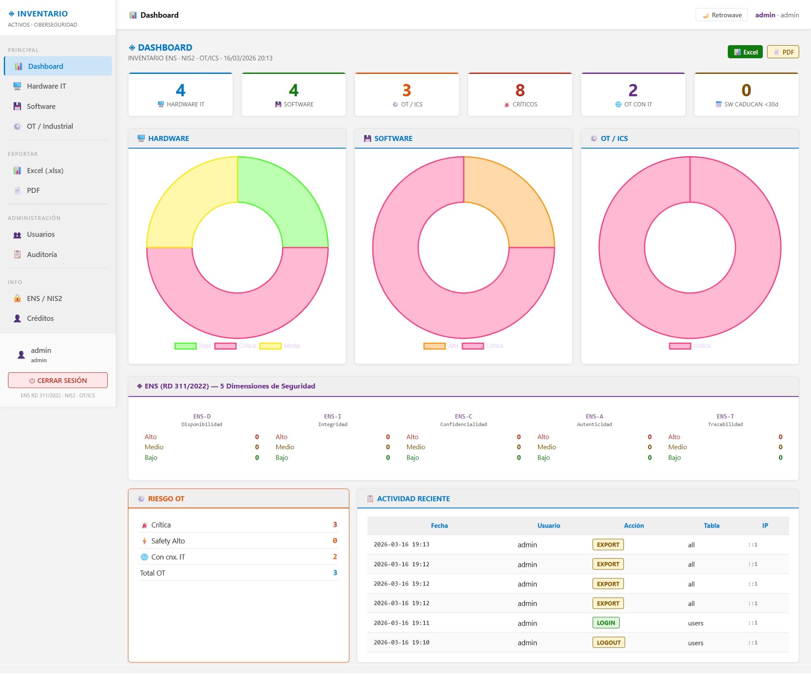

**Gestión de Hardware IT**
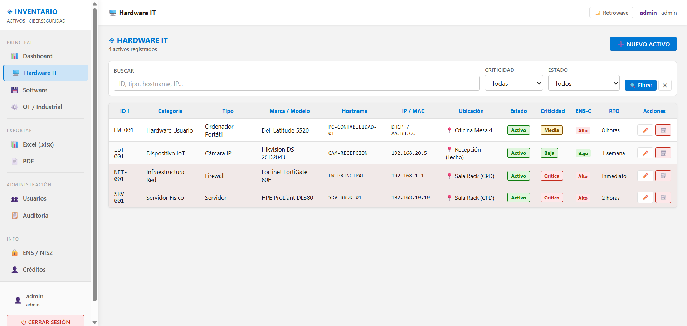

**Módulo Específico para OT / Industrial (Modelo Purdue y Air-gap)**
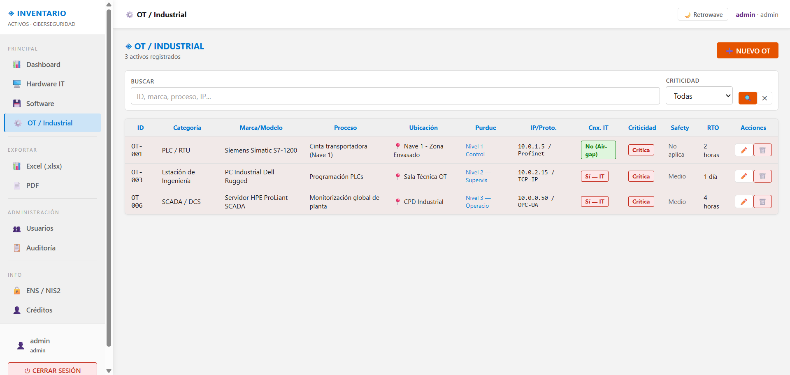

**Control de Licencias de Software**
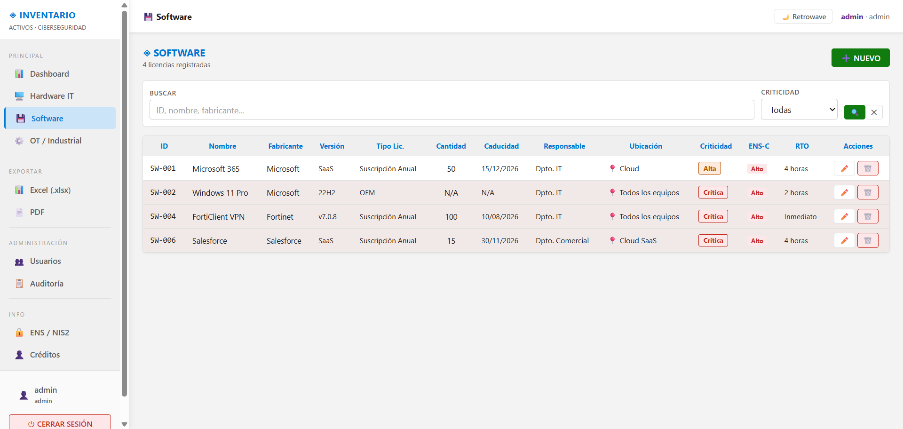

**Acceso Seguro y Cambio de Contraseña Obligatorio (Tema Retrowave 🌙)**
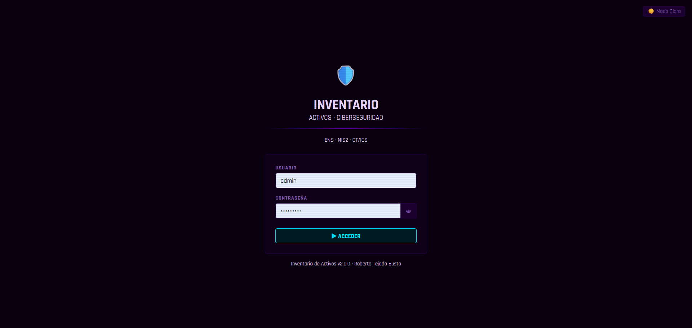
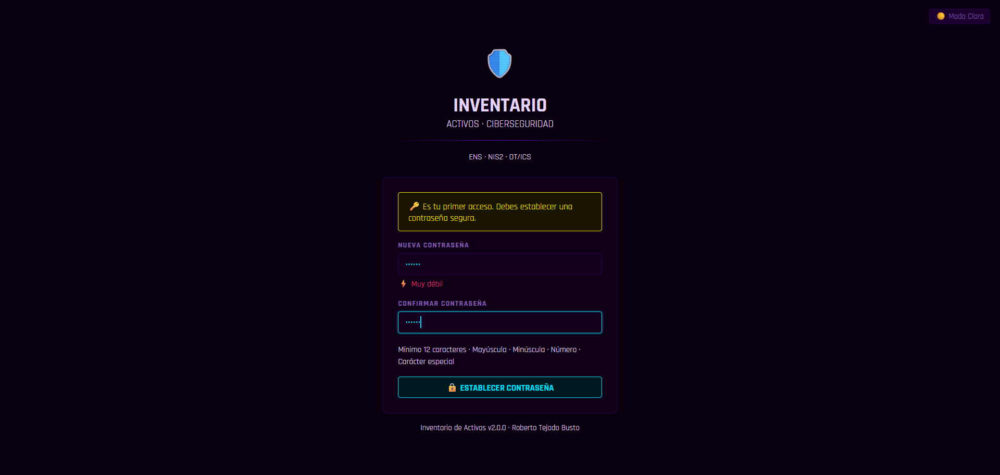

### ✨ Características Principales

* **Cumplimiento Normativo Integrado:** Clasificación de activos preparada para auditorías del **Esquema Nacional de Seguridad (ENS - RD 311/2022)** (dimensiones D, I, C, A, T) y la directiva europea **NIS2** (RTO, cadena de suministro, dependencias).
* **Gestión de Entornos IT y OT:** Pestañas dedicadas para Hardware, Software y un módulo especial para **Tecnología de Operaciones (OT / ICS)** con mapeo del Nivel Purdue, segmentación IT/OT y evaluación de riesgos *Safety*.
* **Exportación Avanzada:** * 📊 **Excel (.xlsx):** Generación nativa de archivos Excel con pestañas separadas y un Dashboard resumen.
  * 📄 **PDF:** Informes maquetados y listos para imprimir utilizando la librería `mPDF`.
* **Control de Acceso (RBAC):** Sistema de usuarios con roles definidos (Administrador, Editor, Lector) y registro de auditoría (logs) de las acciones realizadas.
* **Dual Theme:** Interfaz de usuario fluida con cambio en tiempo real entre un modo profesional claro (**Fluent Design ☀️**) y un modo oscuro inmersivo (**Retrowave 🌙**).

### 🛠️ Stack Tecnológico

* **Backend:** PHP 8.2+ (Nativo, sin frameworks pesados para máxima velocidad).
* **Base de datos:** PDO (Compatible con SQLite / MySQL).
* **Frontend:** HTML5, CSS3 (Variables CSS nativas) y Vanilla JavaScript.
* **Dependencias:** `mPDF` (vía Composer) para la generación de PDFs.

### 🚀 Instalación y Despliegue (Entorno XAMPP/Apache)

1. **Clonar el repositorio** dentro de la carpeta pública de tu servidor web (ej. `C:\xampp\htdocs\inventario_web`).
2. **Habilitar extensiones PHP:** Asegúrate de que las siguientes extensiones estén descomentadas en tu archivo `php.ini`:
   * `extension=zip` (Para exportar el Excel).
   * `extension=gd` y `extension=mbstring` (Para que mPDF procese correctamente el PDF).
   * *Recuerda reiniciar Apache después de modificar el `php.ini`.*
3. **Instalar dependencias:** Abre la terminal en la carpeta del proyecto y ejecuta:
   ```bash
   composer require mpdf/mpdf

🖥️ PC Audit to CSV Converters

Este repositorio contiene scripts en Python diseñados para procesar, limpiar y estructurar los reportes generados por herramientas gratuitas de auditoría de hardware y software (Free PC Audit y WinAudit).

El objetivo principal de estos scripts es transformar los datos crudos de las auditorías en archivos CSV limpios, normalizados y listos para ser importados en la  herramienta  de gestión de activos, añadiendo además una capa interactiva para catalogar los activos según normativas de seguridad.
🚀 Características Principales

    Extracción Inteligente: Identifica y separa automáticamente la información de Hardware (Hostname, SO, CPU, RAM, Discos, IP, MAC, Número de Serie) y Software instalado.

    Limpieza de Ruido (Software): * Elimina coletillas de arquitectura (64-bit, x86, etc.).

        Filtra aplicaciones innecesarias para el inventario (ej. [Store App], runtimes secundarios de C++).

        Agrupa y unifica versiones de software idéntico instalado en el mismo equipo (ej. unifica las distintas versiones de Python o Microsoft Edge).

    Métricas de Seguridad y Continuidad (Interactivas): Al ejecutar el script, se solicitan datos interactivos con validación de entrada para catalogar el activo:

        Criticidad (Baja, Media, Alta).

        ENS (Esquema Nacional de Seguridad): Dimensiones de Disponibilidad, Integridad, Confidencialidad, Autenticidad y Trazabilidad.

        RTO (Recovery Time Objective).

        Criticidad del Proveedor.

        Ubicación, Responsable y Dependencias.

    Generación de Archivos Separados: Produce dos archivos CSV independientes por cada máquina auditada: uno para Hardware (HW_*.csv) y otro para Software (SW_*.csv).

📁 Scripts Incluidos
1. FreePCAudit2CSV.py

Procesa los archivos de texto plano (.txt) generados por Free PC Audit. Utiliza expresiones regulares para localizar bloques específicos de hardware, red y la lista de software instalado.
2. WinAudit2CSV.py

Procesa los archivos en formato .csv generados por WinAudit. Realiza una lectura binaria inteligente para evitar problemas de codificación (utf-8, utf-16, latin-1), detecta automáticamente el separador y filtra los datos basándose en los códigos de WinAudit (ej. 300 para Hardware, 500 para Software).
🛠️ Requisitos

    Python 3.x

    Librería pandas

Puedes instalar las dependencias necesarias ejecutando:
Bash

pip install pandas

📖 Modo de Uso

    Realiza la auditoría en el equipo cliente usando Free PC Audit (exportando a .txt) o WinAudit (exportando a .csv).

    Coloca el archivo generado en la misma carpeta que el script.

    Ejecuta el script correspondiente desde la terminal:
    Bash

    python FreePCAudit2CSV.py
    # o
    python WinAudit2CSV.py

    El script te pedirá el nombre del archivo de origen por consola.

    Responde a las preguntas interactivas para rellenar los metadatos de asignación y seguridad (Criticidad, ENS, etc.).

    Recoge tus archivos HW_...csv y SW_...csv listos para importar.


    
---

## 👨‍💻 Autor y Licencia

**Roberto Tejado Busto**
* [LinkedIn](https://www.linkedin.com/in/roberto-tejado/)
* [GitHub](https://github.com/robertotejado)

Este proyecto se distribuye bajo la **Licencia MIT**. Siéntete libre de usarlo, modificarlo y compartirlo, manteniendo siempre los créditos del autor original.
